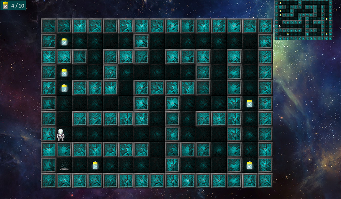

# MazeKent
> a puzzle game to solve a randomly generated maze




## Installation

Windows:

```cmd
mkdir d:\MazeKent && cd /d d:\MazeKent
python -m venv venv && venv\scripts\activate
git clone https://github.com/ma1ex/MazeKentGame.git
pip install -r requirements.txt
```

## Run game

Windows:

```cmd
cd /d d:\MazeKent
venv\scripts\activate
python main.py
```

## Control


## Dependencies
> Only the [Arcade Library](https://github.com/pythonarcade/arcade "Arcade is built on top of Pyglet and OpenGL") and its internal dependencies are used.

### Requirements
- Python >= 3.6
- Arcade is built on top of `Pyglet` and `OpenGL`, so your video card must be compatible with `OpenGL`!

## Release History

* 0.1.0
    * First commit
    * Work in progress

## Contributing

1. Fork it (<https://github.com/ma1ex/MazeKentGame/fork>)
2. Create your feature branch (`git checkout -b feature/fooBar`)
3. Commit your changes (`git commit -am 'Add some fooBar'`)
4. Push to the branch (`git push main feature/fooBar`)
5. Create a new Pull Request

## License

Distributed under the MIT license. See ``LICENSE.md`` for more information.
